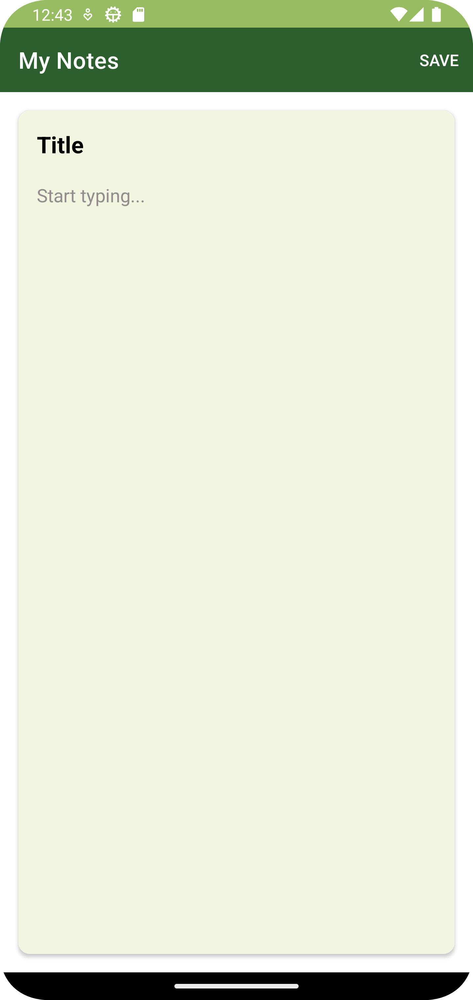
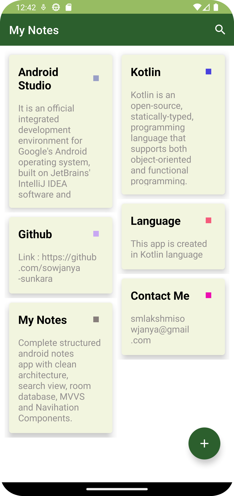
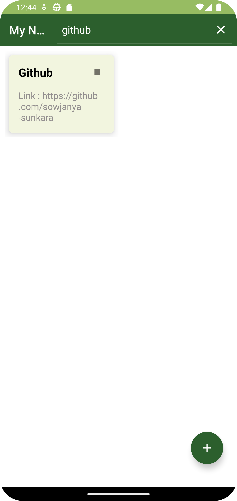

# Notes app is created in kotlin language

### Clone The Project to Your Local Machine and See the Magic

<h1>Samples Of My Notes App Down Here 👇</h1>

Home Page

Create a new note here

All the created notes will be displayed here in the home page.

We can update the note.

We can delete the note.

We can search the note in the search bar which is displayed on the top.

